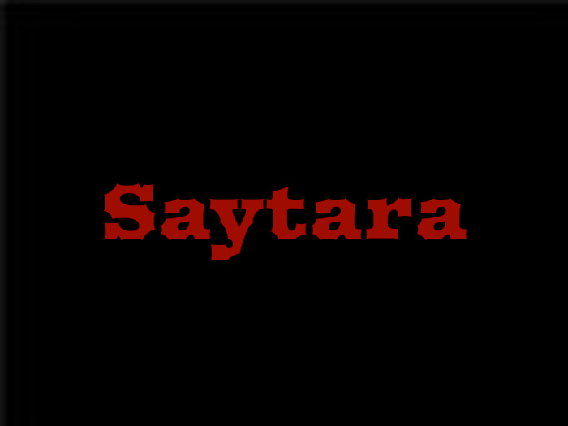

[ education purpose only ]
 
<h3>Saytara HTTP Advanced Banking Botnet Beta v 1 - (katana v 2)</h3>
<h4>features :</h4> 
cmd exec , screenshot , download nd execute 
 
<h4>advanced features (modules ) :</h4> 
ransomware (AES)
 
Clipper crypto wallets (btc,btcash,ether,doge,ltc,xmr,xrp,neo,dash)
 
web grabber (browser,title,user,pass) for selenium driver based browsers & chromium driver based browsers 
 
hvnc (client/server)   
 
<h4>other stuff :</h4> 
stable build , small size loader , no junks (based in memory),fud somehow,antivm,anti-debug & analyse tools, secure p2p connection
  
#malware , #Saytara , #katana , #botnet , #banking
 
<h4>By Saytara Team &copy; </h4>Authors: ABDO10_DZ https://t.me/ABDO10_DZ & david.ru https://t.me/bool_david
 Channel : https://t.me/saytara_dz  
 
overview : https://www.youtube.com/watch?v=kGtN5Sum82Q
  
[ education purpose only ]

   

